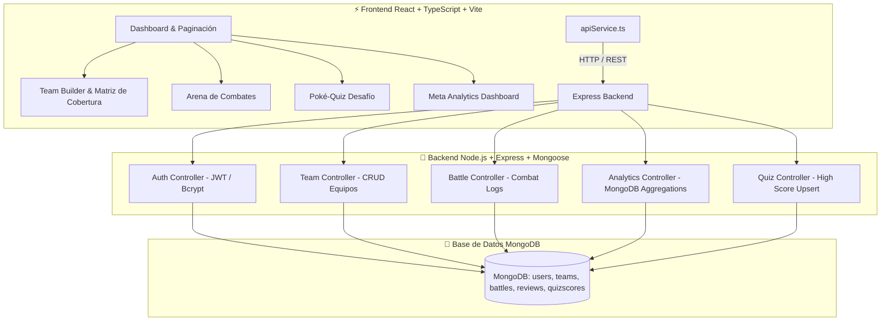

# 🎮 PokéDex Ultimate & Tactical Meta Suite — Fullstack Portfolio Showcase

<div align="center">
  
  
  
  [](https://reactjs.org/)
  [](https://www.typescriptlang.org/)
  [](https://nodejs.org/)
  [](https://www.mongodb.com/)
  [](https://vitejs.dev/)
  [](https://web.dev/progressive-web-apps/)
  [](https://gravity-ui.com/)

**Una Aplicación Fullstack Profesional para Análisis Táctico, Simulador de Combates, Team Builder Persistente y Analytics con MongoDB.**

</div>

---

## 📋 Tabla de Contenidos

- [🏗️ Arquitectura del Sistema](#️-arquitectura-del-sistema)
- [✨ Funcionalidades de Nivel Senior](#-funcionalidades-de-nivel-senior)
- [🔌 Especificación de API Endpoints](#-especificación-de-api-endpoints)
- [🛠️ Tecnologías y Herramientas](#️-tecnologías-y-herramientas)
- [🚀 Guía de Instalación y Ejecución](#-guía-de-instalación-y-ejecución)
- [👥 Celda de Subagentes (awesome-copilot)](#-celda-de-subagentes-awesome-copilot)
- [🧪 Pruebas y CI/CD](#-pruebas-y-cicd)
- [📜 Licencia](#-licencia)

---

## 🏗️ Arquitectura del Sistema



---

## ✨ Funcionalidades de Nivel Senior

### 🛡️ 1. Team Builder & Matriz Táctica de Cobertura (18 Tipos)
- Permite diseñar alineaciones competitivas de 6 slots con búsqueda predictiva instantánea.
- **Matriz Táctica:** Evalúa en tiempo real las 18 combinaciones defensivas (debilidades 2x/4x, resistencias 0.5x/0.25x e inmunidades 0x).
- **Persistencia & Modo Invitado:** Permite guardar equipos en MongoDB tanto a usuarios autenticados como a visitantes en modo "Entrenador Invitado".

### 📊 2. Meta Analytics con MongoDB Aggregation Framework
Demuestra uso avanzado de agregaciones complejas en MongoDB (`$unwind`, `$group`, `$sort`, `$project`, `$cond`, `$divide`):
- **Pokémon más Populares:** Frecuencia de selección en la colección `teams`.
- **Tasa de Victoria (% WinRate):** Cálculo matemático condicional sobre la colección `battles`.
- **Presencia por Tipo:** Métricas consolidadas en combates.

### ❓ 3. Poké-Quiz Desafío: "¿Quién es este Pokémon?"
- Juego de silueta con filtro CSS `brightness(0)`, contador de racha multiplicadora, 4 opciones múltiples y temporizador.
- **Leaderboard con Upsert:** Sistema en MongoDB que mantiene el **récord personal máximo** de cada entrenador sin duplicar filas.

### ⚔️ 4. Arena de Combate Persistente
- Enfrentamientos animados en `Framer Motion` con retro Web Audio API y confeti.
- El log completo del combate se sincroniza en segundo plano con MongoDB al finalizar la batalla.

### 📄 5. Sistema de Paginación Profesional
- Reemplaza la carga masiva por un control de paginación fluido (24, 48, 96 o 120 ítems por página), selector directo y reset de scroll arriba al cambiar de vista.

### ⚡ 6. Resiliencia de Infraestructura y PWA
- **Fallback Automático DB:** [`db.ts`](file:///c:/Users/Sebastian/Desktop/Programacion/proyectos/poke-api/backend/src/config/db.ts) conmuta automáticamente entre MongoDB local, Atlas y `MongoMemoryServer` para asegurar ejecución inmediata.
- **Recuperación de Puerto:** Express recupera automáticamente conflictos de puerto `EADDRINUSE` (5000 ➔ 5001) y la API en el frontend detecta el puerto activo dinámicamente.
- **PWA:** Manifest (`manifest.json`) y Service Worker (`sw.js`) habilitan uso sin conexión e instalación en móviles/escritorio.

---

## 🔌 Especificación de API Endpoints

| Módulo | Método | Endpoint | Descripción |
| :--- | :--- | :--- | :--- |
| **Auth** | `POST` | `/api/auth/register` | Registro de entrenador con password bcrypt |
| **Auth** | `POST` | `/api/auth/login` | Login y emisión de token JWT |
| **Auth** | `GET` | `/api/auth/me` | Obtención de perfil autenticado |
| **Equipos** | `GET` | `/api/teams/public` | Listar equipos públicos de la comunidad |
| **Equipos** | `POST` | `/api/teams` | Guardar equipo (soporta usuarios y visitantes) |
| **Equipos** | `DELETE` | `/api/teams/:id` | Eliminar equipo propio |
| **Batallas** | `POST` | `/api/battles` | Guardar log de combate |
| **Batallas** | `GET` | `/api/battles` | Obtener batallas recientes |
| **Analytics** | `GET` | `/api/analytics/top-pokemons` | Agregación MongoDB: Pokémon más elegidos |
| **Analytics** | `GET` | `/api/analytics/type-popularity` | Agregación MongoDB: Presencia de tipos |
| **Analytics** | `GET` | `/api/analytics/win-rates` | Agregación MongoDB: WinRate por Pokémon |
| **Quiz** | `POST` | `/api/quiz/score` | Guardar/Actualizar récord personal |
| **Quiz** | `GET` | `/api/quiz/leaderboard` | Obtener Tabla de Posiciones Global |

---

## 🛠️ Tecnologías y Herramientas

- **Frontend:** React 18, TypeScript, Vite, Framer Motion, `@gravity-ui/uikit`, SWR, Canvas Confetti.
- **Backend:** Node.js, Express, TypeScript, Mongoose, MongoDB, JSON Web Tokens (JWT), BcryptJS, MongoMemoryServer.
- **Testing & DevOps:** Vitest, GitHub Actions (`ci.yml`), Service Worker (PWA).

---

## 🚀 Guía de Instalación y Ejecución

### 1. Clonar el Repositorio
```bash
git clone https://github.com/tu-usuario/poke-api.git
cd poke-api
```

### 2. Iniciar el Backend (Node.js + MongoDB)
```bash
cd backend
npm install
npm run dev
```
*(Servidor ejecutándose en `http://localhost:5000`)*

> 💡 **Script de Semilla:** Carga usuarios y equipos de prueba iniciales ejecutando en `backend/`:
> ```bash
> npx ts-node src/seed.ts
> ```

### 3. Iniciar el Frontend (React + Vite)
En la raíz del proyecto (`poke-api`):
```bash
npm install
npm run dev
```
*(Frontend ejecutándose en `http://localhost:5173`)*

---

## 👥 Celda de Subagentes (`awesome-copilot`)

Este proyecto fue desarrollado bajo la orquestación de una celda de subagentes especializados:
- 👑 **`gem-orchestrator`**: Dirección técnica y definición de contratos de software.
- 🍃 **`api-architect` & `mongodb-performance-advisor`**: Arquitectura de endpoints REST y agregaciones MongoDB.
- ⚡ **`expert-react-frontend-engineer`**: Desarrollo de la UI con React + TypeScript y componentes Gravity UI.
- 🧪 **`react18-test-guardian`**: Pruebas unitarias de efectividad de daño y utilidades.
- 📝 **`project-documenter`**: Redacción de la documentación técnica.

---

## 🧪 Pruebas y CI/CD

- **Pruebas Unitarias:** Ejecutar `npm test` en la raíz o backend para validar las fórmulas de combate y la lógica de controladores.
- **Integración Continua:** El flujo en `.github/workflows/ci.yml` ejecuta linters, typechecking de TypeScript (`tsc --noEmit`) y build de Vite en cada Push/Pull Request.

---

## 📜 Licencia
Este proyecto es de código abierto y está disponible bajo la licencia MIT.
