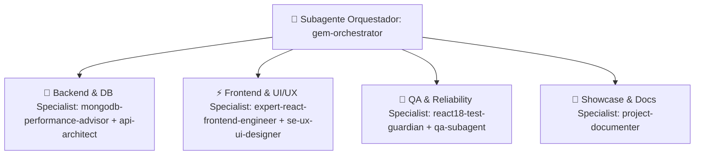

# 🛸 Equipo de Subagentes & Plan de Arquitectura Fullstack (MongoDB + React + TS)

> **Proyecto:** PokeAPI Portfolio Upgrade  
> **Ubicación de Subagentes:** `C:\Users\Sebastian\Desktop\Programacion\awesome-copilot`  
> **Estado:** Fase 0 — Selección de Subagentes y Diseño de Solución  

---

## 🎭 1. Estructura del Equipo de Subagentes (Roles & Responsabilidades)

Para transformar este proyecto en una pieza clave de nivel **Senior Fullstack (React + Node.js + MongoDB)**, hemos seleccionado y configurado la siguiente celda de trabajo especializada basada en `awesome-copilot`:

### 📋 Ficha de Subagentes Seleccionados:

1. **👑 Orquestador General (`gem-orchestrator` / `project-architecture-planner`)**
   - **Ruta spec:** `C:\Users\Sebastian\Desktop\Programacion\awesome-copilot\agents\gem-orchestrator.agent.md`
   - **Misión:** Coordinar el flujo de trabajo en fases, definir los contratos API entre Frontend y Backend, garantizar que no haya regresiones y validar los 'gates' de calidad.

2. **🍃 Backend & Database Specialist (`api-architect` + `mongodb-performance-advisor`)**
   - **Ruta spec:** `.../awesome-copilot/agents/api-architect.agent.md` y `.../mongodb-performance-advisor.agent.md`
   - **Misión:** Diseñar la API RESTful en Node.js/Express con Mongoose, implementar modelos de datos, validaciones DTO, autenticación JWT, índices MongoDB y **Pipelines de Agregación avanzados** (estadísticas globales de combate y popularidad de equipos).

3. **⚡ Frontend & UI/UX Specialist (`expert-react-frontend-engineer` + `se-ux-ui-designer`)**
   - **Ruta spec:** `.../awesome-copilot/agents/expert-react-frontend-engineer.agent.md`
   - **Misión:** Migrar el proyecto a **TypeScript (`.tsx`)**, construir la nueva pantalla **Team Builder con Matriz de Cobertura de Tipos**, enriquecer el `BattleSimulator` con log de turnos y sincronizar con el Backend vía SWR/Axios.

4. **🧪 QA & Quality Specialist (`react18-test-guardian` + `qa-subagent`)**
   - **Ruta spec:** `.../awesome-copilot/agents/react18-test-guardian.agent.md`
   - **Misión:** Configurar la suite de pruebas unitarias en **Vitest** (fórmulas de daño, cobertura de tipos), pruebas de integración para la API MongoDB (Supertest) y verificación visual/E2E.

5. **📝 Documenter & Showcase Specialist (`project-documenter` / `se-technical-writer`)**
   - **Ruta spec:** `.../awesome-copilot/agents/project-documenter.agent.md`
   - **Misión:** Redactar un `README.md` estelar con diagramas Mermaid, guía de instalación del Backend con Docker / MongoDB Atlas, colección de Postman/REST y métricas de rendimiento.

---

## 💡 2. Lluvia de Ideas & Valor Agregado con MongoDB

Integrar MongoDB no es solo "guardar datos", es **demostrar habilidades backend reales** que los reclutadores buscan:

### ⚙️ Backend (Servidor `backend/` con Express + MongoDB + Mongoose)
1. **Autenticación & Perfil de Entrenador (JWT + Bcrypt):**
   - Colección: `users` (Nombre, avatar, email, passwordHash, nivel de entrenador, estadisticas de batallas).
2. **Team Builder Persistente:**
   - Colección: `teams` (Nombre del equipo, arreglo de 6 Pokémons con moves, EVs, IVs, naturaleza, nota táctica, flag público/privado).
3. **Historial de Combates & Analytics (MongoDB Aggregations):**
   - Colección: `battles` (PlayerTeam, EnemyTeam, ganador, turnos, log completo de acciones, fecha).
   - **MongoDB Aggregation Pipelines:** Endpoint `/api/analytics/top-pokemons` y `/api/analytics/type-meta` para saber qué tipos/Pokémon ganan más combates en la plataforma. ¡Demuestra uso de `$unwind`, `$group`, `$sort`, `$lookup`!
4. **Reseñas & Notas de la Comunidad por Pokémon:**
   - Colección: `reviews` (PokemonId, UserId, calificación competitiva, comentarios tácticos).

---

## 🎨 3. Plan Integrado de Front (React + TypeScript) + Back (MongoDB)

### 📌 Fase A: Migración a TypeScript & Arquitectura Fullstack
- Inicializar subdirectorio `backend/` con TypeScript, Express, Mongoose, dotenv, cors, jsonwebtoken, bcryptjs.
- Migrar `src/` del Frontend a `.tsx` creando `/src/types/pokemon.ts`, `/src/types/team.ts`, `/src/types/battle.ts`.

### 📌 Fase B: Sistema de Autenticación & Team Builder
- Pantalla de Login / Registro en Frontend.
- Componente `TeamBuilderView.tsx`: Selección interactiva de 6 Pokémon, configuración de IVs/EVs, análisis de **Matriz de Cobertura de Tipos en Tiempo Real** (fortalezas/debilidades del equipo) y botón "Guardar en MongoDB".

### 📌 Fase C: Motor de Combate Avanzado & Persistencia en MongoDB
- Mejorar `BattleSimulator.tsx`: Fórmula real de daño (Nivel, Atk/Def, STAB, Efectividad 18x18, Aleatoriedad 85-100%).
- Al terminar un combate: guardar el log de la batalla en MongoDB.
- Mostrar la pantalla de **Historial de Combates** navegable.

### 📌 Fase D: Dashboard de Analytics en Tiempo Real & PWA / Performance
- Vista de **Meta Analytics** conectada a la agregación de MongoDB (Gráficos interactivos de uso y winrate).
- Optimización con Virtual Scroll (`@tanstack/react-virtual`) para la galería de Pokémon.
- PWA / Offline fallback con SWR + Service Workers.

### 📌 Fase E: Pruebas, CI/CD & Documentación Final
- Cobertura de tests unitarios e integración (Vitest + Supertest).
- `README.md` profesional listo para impresionar en portafolios.

---

## 🏁 Siguientes Pasos
1. Revisar y confirmar este documento.
2. Iniciar la **Fase A (Setup del Backend MongoDB + Migración TS en Frontend)** con el equipo de subagentes.
